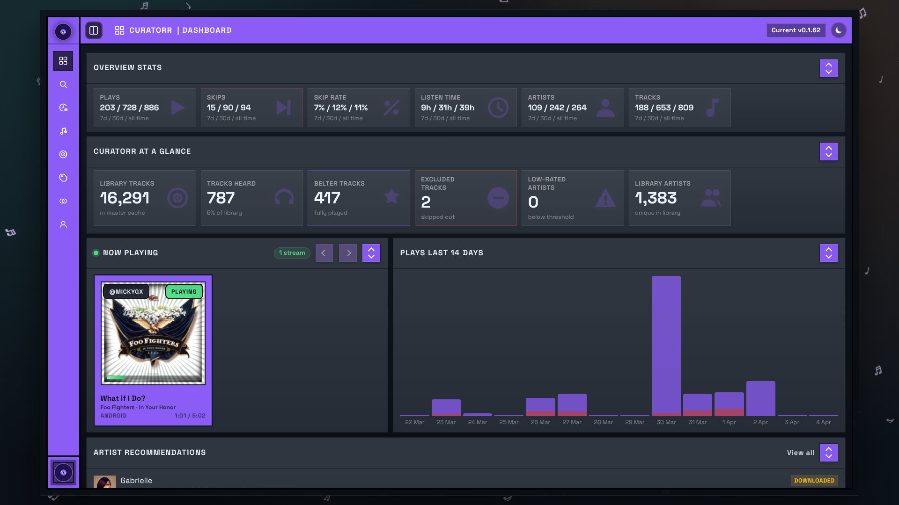

# Curatorr

Curatorr is a self-hosted Plex, Jellyfin, and Emby companion for playback tracking, smart playlist generation, artist discovery, and optional Lidarr automation.

[](https://github.com/MickyGX/curatorr/releases/latest)
[](https://discord.gg/TvrxJWD4PK)
[](https://www.buymeacoffee.com/MickyGX)

## Preview



## What It Does

- Tracks playback from Plex, Jellyfin, or Emby
- Builds per-user smart playlists from real listening behavior
- Supports personal playlists, blended playlists, Curatorr rotating playlists, and configurable Daily Mix
- Adds feature-driven playlist building with BPM, key, Camelot, energy, and danceability filters when analysis data is available
- Surfaces library-based suggestions and external discovery
- Integrates with Lidarr for optional add, queue, and progression workflows
- Supports Last.fm history/station features and ListenBrainz playlist suggestions on supported server paths

## Media Server Support

- **Plex**: broadest feature set, including Plex SSO, Plex Home users, native Plex webhooks, optional Tautulli support, Daily Mix, Last.fm station playlists, and ListenBrainz playlist suggestions
- **Jellyfin**: native server login, library indexing, live playback tracking, smart playlists, personal playlists, blended playlists, discovery, and Lidarr automation
- **Emby**: native server login, library indexing, live playback tracking, smart playlists, personal playlists, blended playlists, discovery, and Lidarr automation

Current Plex-only features:

- Tautulli integration
- Daily Mix sync
- Last.fm station playlists
- ListenBrainz playlist suggestion sync
- Sonic ordering and loudness-aware sequencing

## Analyzer Sidecar

Curatorr can enrich tracks with `BPM`, `musical key`, `Camelot key`, `energy`, and `danceability` through the optional `curatorr-analyzer` sidecar.

Minimal Docker Compose example:

```yaml
services:
  curatorr:
    image: mickygx/curatorr:latest
    container_name: curatorr
    ports:
      - "7676:7676"
    environment:
      - CONFIG_PATH=/app/config/config.json
      - DATA_DIR=/app/data
      - BASE_URL=http://localhost:7676
      - TRUST_PROXY=true
      - TRUST_PROXY_HOPS=1
      # Optional: required for Spotify playlist import and refresh.
      # Add the same callback URL in your Spotify app settings:
      # http://localhost:7676/user-settings/spotify/callback
      # - SPOTIFY_CLIENT_ID=your-spotify-client-id
      # - SPOTIFY_CLIENT_SECRET=your-spotify-client-secret
      - SESSION_SECRET=replace-this-with-a-random-secret
      - WEBHOOK_SECRET=replace-this-with-a-random-secret
    volumes:
      - ./config:/app/config
      - ./data:/app/data
      - ./data/icons/custom:/app/public/icons/custom
    network_mode: bridge
    restart: unless-stopped

  curatorr_analyzer:
    image: mickygx/curatorr-analyzer:latest
    container_name: curatorr_analyzer
    depends_on:
      - curatorr
    environment:
      - PORT=8765
    volumes:
      - ./data:/app/data
      # Mount your music library at the same absolute path Plex reports for track files.
      # Example:
      # - /path/to/music:/media/music:ro
    network_mode: "service:curatorr"
    restart: unless-stopped
```

Optional Spotify import setup:

- Uncomment `SPOTIFY_CLIENT_ID` and `SPOTIFY_CLIENT_SECRET` if you want users to connect Spotify accounts and import Spotify playlists.
- In the Spotify developer app, add a redirect URI that matches your Curatorr base URL, for example `http://localhost:7676/user-settings/spotify/callback`.

How to get the Spotify secrets:

1. Go to the [Spotify Developer Dashboard](https://developer.spotify.com/dashboard) and sign in.
2. Click `Create app`.
3. Give the app a name and description, then choose `Web API`.
4. Open the app settings and add a redirect URI that matches your Curatorr base URL, for example `http://localhost:7676/user-settings/spotify/callback`.
5. Save the app settings.
6. Copy the app `Client ID` into `SPOTIFY_CLIENT_ID`.
7. Use `View client secret` to copy the `Client Secret` into `SPOTIFY_CLIENT_SECRET`.

Then in `Settings -> General -> Track Analysis Import`:

- set `Analyzer mode` to `Analyzer sidecar`
- set `Analyzer sidecar URL` to `http://127.0.0.1:8765`
- set `Feature manifest path` to `/app/data/track-features.json`
- set `Analyzer results path` to `/app/data/track-features.results.json`
- run `Track Analysis Pipeline`

## Documentation

For installation, setup, configuration, and troubleshooting:

- [GitHub Wiki](https://github.com/MickyGX/curatorr/wiki)
- [Wiki Home](docs/wiki/Home.md)
- [Quick Start](docs/wiki/Quick-Start.md)
- [Configuration](docs/wiki/Configuration.md)
- [Authentication and Roles](docs/wiki/Authentication-and-Roles.md)
- [Integrations](docs/wiki/Integrations.md)
- [Track Analysis](docs/wiki/Track-Analysis.md)
- [Artist Suggestions and Lidarr Activity](docs/wiki/Artist-Suggestions-and-Lidarr-Activity.md)
- [Discover](docs/wiki/Discover.md)
- [Smart Playlists](docs/wiki/Smart-Playlists.md)
- [History](docs/wiki/History.md)
- [Tracks](docs/wiki/Tracks.md)
- [Blend](docs/wiki/Blend.md)
- [User Profile](docs/wiki/User-Profile.md)
- [Troubleshooting](docs/wiki/Troubleshooting.md)
- [FAQ](docs/wiki/FAQ.md)

## Support

- [Discord](https://discord.gg/TvrxJWD4PK)
- [GitHub Discussions](https://github.com/MickyGX/curatorr/discussions)
- [GitHub Wiki](https://github.com/MickyGX/curatorr/wiki)
