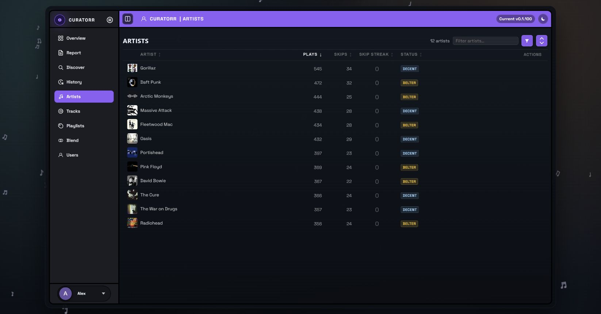

# Artists, Suggestions, and Lidarr Activity

Use **Artists** to inspect listening statistics and **Discover → Artist Pipeline** to follow recommendations and acquisitions. Older versions of this guide described separate Suggested Artists and Lidarr Activity panels on the Artists page; those instructions no longer match the current layout.

## Artists table

The table shows artist name, plays, skips, skip streak, and current status. Search by name, sort the columns, or filter to **All**, **Played**, **Skipped**, or **Belter** artists.

Click an artist to open its detail popup. **Reset skips**, where available, clears the artist's skip streak; use it when you intend to change that state, rather than as a way to hide rows.

Artist tiers summarise your listening. They are separate from the recommendation score shown in Discover.

## Recommendations

The [Artist Pipeline](Discover.md#artist-pipeline) combines candidates from your library and Last.fm similar artists. Curatorr builds a taste profile from listening history, genre affinity, and personal preferences, then ranks candidates using:

- **Genre fit:** up to three matching genres contribute to the score.
- **Behaviour:** unheard and lightly played artists receive a discovery boost; heavier listening reduces that boost.
- **Editorial:** catalog breadth, liked genres, and Last.fm similarity can add weight.

Last.fm candidates derive genre context from related seed artists and can be enriched with Last.fm tags. Your personal artist filters also affect recommendations. Run or schedule **Artist Pipeline Rebuild** to refresh the cached suggestions.

## Acquisition through Lidarr

An eligible request adds the artist if needed, monitors a starter album, and can trigger a search. You may select the album yourself or let Curatorr choose. Already being present in Lidarr does not mean files have arrived in your media-server library.

The pipeline presents four overall states: **Suggested**, **In progress**, **Stuck**, and **In your library**. Recently Requested and Recently Added Albums provide album-level context. Check **Settings → Logs → Lidarr** and Lidarr itself for detailed search failures or download progress.

## Quotas and automation

Administrators configure the connection, automation scope, role-based weekly artist/album quotas, and separate automatic-add limits in **Settings → Lidarr**. Quota chips show current availability; requests can wait in the queue when a limit is reached.

Automatic adding is optional. When enabled, Curatorr can queue eligible top recommendations, including external Last.fm candidates, subject to those limits. It skips artists already present in Lidarr rather than adding them again.

## Album progression

After acquiring a starter album, Curatorr uses subsequent listening engagement to decide whether to unlock more of the catalog. A stronger positive signal can unlock another album; insufficient engagement can leave an artist waiting. Search retries and fallback release grabs depend on your Lidarr automation settings.

Use the relevant Lidarr jobs in **Settings → Jobs** and the logs to diagnose requests that stop progressing. See [Troubleshooting](Troubleshooting.md) and [Integrations](Integrations.md#lidarr).
