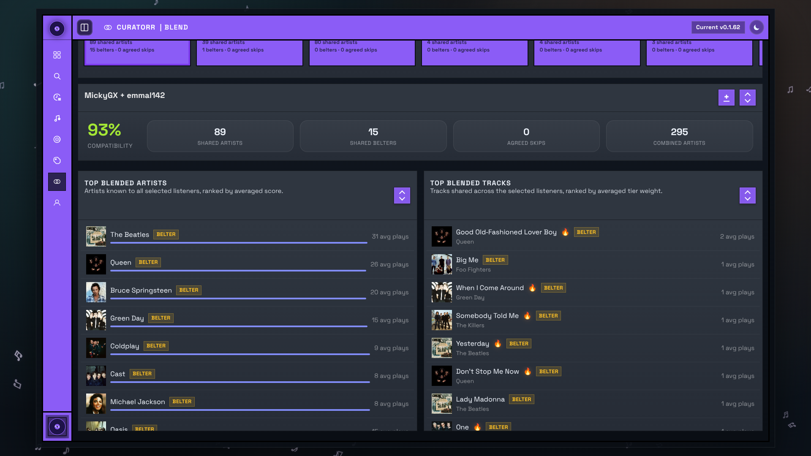

# Blend

The Blend page compares your listening profile with other listeners and helps you build shared playlist ideas.

## Blend Queue

The carousel shows listeners who have enough overlap with your history to calculate blend stats.

Each card includes:

- compatibility percentage
- shared artist count
- shared belter count
- agreed skip count

Select one or more listeners to calculate the blend.

If someone does not appear here yet, Curatorr usually does not have enough overlapping listening history to produce a meaningful comparison.

## Blend results

Once listeners are selected, Curatorr shows:

- overall compatibility
- shared artists
- shared belters
- agreed skips
- combined artist count

## Top Blended Artists

This list surfaces artists known to all selected listeners, ranked by averaged artist score.

## Top Blended Tracks

This list surfaces tracks shared across the selected listeners, ranked by averaged tier weight.

## Creating a blended playlist

The Blend page is primarily for comparison and selection.

Saved blended playlists are managed from [Smart Playlists](Smart-Playlists.md) and the main Playlists page.
