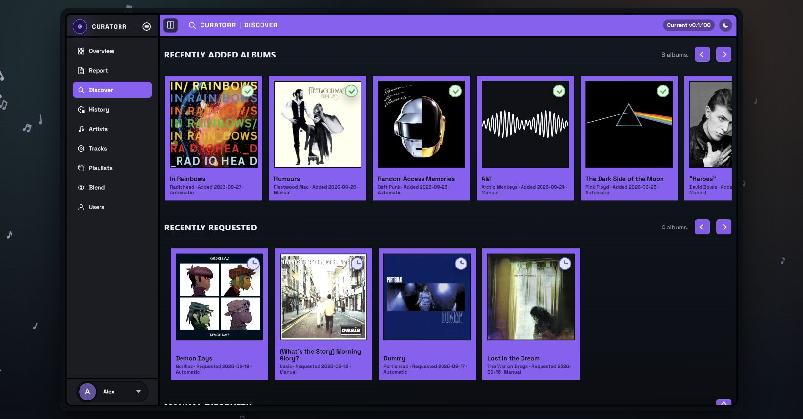
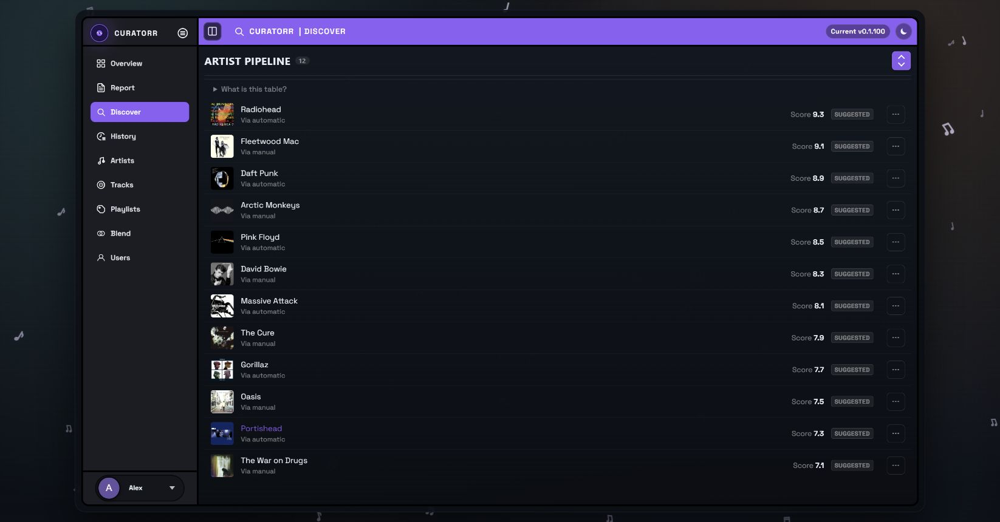

# Discover

Discover brings together recent acquisitions, external music discovery, manual requests, and the **Artist Pipeline**.

## Recently Added Albums and Recently Requested

**Recently Added Albums** shows albums that reached your library. **Recently Requested** shows acquisition requests, including albums monitored in Lidarr that have not arrived yet. Cards show the artist, date, and manual/automatic origin. Use their view and options controls to inspect an album and the actions available for it.

These rows replace the older documentation's separate **Added For You** view.

## Trending and similar music

- **Trending Artists** and **Trending Tracks** use Last.fm's current charts.
- **Because You Like…** uses artists related to your listening profile. Its heading names the seed artist.

These panels need the shared Last.fm API key in **Settings → Discovery**, where administrators can choose which panels are shown. The account used for your personal Last.fm history is configured separately in [User Profile](User-Profile.md).

## Manual Discovery

Search for an artist by name. When Lidarr is configured, Curatorr looks up artists and albums so you can choose a specific album or let Curatorr select a starter album. Existing library/Lidarr status helps distinguish an acquisition from music you already have.

Requests follow the configured role permissions and weekly quotas. Requests that cannot proceed immediately can wait in the queue. When the Queue is shown, reorder pending entries to change their priority or remove requests you no longer want.

## Artist Pipeline

The pipeline combines catalog-based recommendations with Last.fm similar-artist candidates. A Last.fm icon identifies externally sourced suggestions. It is no longer limited to artists already in your media-server library.

| State | Meaning |
|---|---|
| **Suggested** | Recommended, with no acquisition started |
| **In progress** | Sent to Lidarr; a starter album is monitored or being acquired |
| **Stuck** | Acquisition needs attention, for example missing files or quota limits |
| **In your library** | A starter album has arrived; successful entries age out after 14 days |

Open an artist or its options menu to inspect the available actions. Depending on status and permissions, these include adding to your library, selecting an album, letting Curatorr choose, or dismissing a suggestion. These actions can create Lidarr requests.

The score combines **Genre Fit + Behaviour + Editorial**. Underplayed artists get a discovery boost; genre affinity, catalog signals, and Last.fm similarity refine the ranking. Use **What is this table?** for the explanation in the app. **Artist Pipeline Rebuild** in Settings → Jobs refreshes artist, album, and track suggestions.

## Automatic acquisition

Automatic adds are optional and controlled by **Settings → Lidarr**, including automation scope, role quotas, and automatic-add quotas. Eligible pipeline candidates can include Last.fm suggestions. Merely opening Discover does not enable automation.

The [Artists and Lidarr guide](Artist-Suggestions-and-Lidarr-Activity.md) explains the distinction between listening statistics, recommendations, acquisition, and subsequent album progression.
