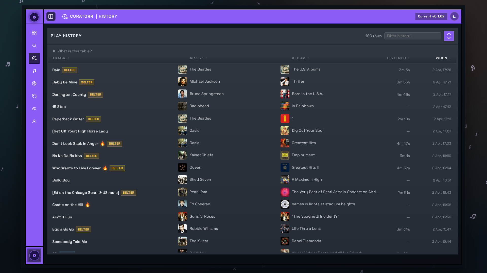

# History

The History page shows your recent playback timeline in chronological order, newest first.

This page is best treated as the playback audit trail behind Curatorr's scoring. If something looks wrong on Dashboard, Playlists, or artist rankings, History is usually the first place to confirm whether the underlying plays were recorded the way you expect.

## What the table shows

- track, artist, and album
- total listened time for the grouped row
- when the newest play in that row happened
- the track's current Curatorr tier badge

Rows marked as skips indicate the track was stopped early.

## Grouping behavior

Curatorr groups repeat plays of the same track inside the latest recent-event window into the newest row shown on the page.

This keeps the table easier to scan while still preserving total listened time.

## Controls

- search across track, artist, album, tier, and skip/play state
- sort by track, artist, album, listened time, or date
- load more rows in batches

## How to use it

- Use the newest rows to confirm webhooks or session polling are landing in Curatorr.
- Compare grouped listened time against the current tier badge when troubleshooting why a track became `Belter`, `Decent`, or `Skip`.
- If a track seems missing from a playlist, check whether recent rows show early stops or repeated skips.

## Important notes

- The tier badge reflects the track's current status, not necessarily the status it had when the play happened.
- If the page is empty, Curatorr has not recorded recent playback for that user yet.
- Playback recording depends on the configured media-server path described in [Integrations](Integrations.md).
