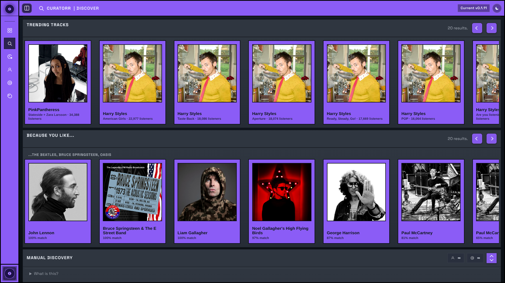
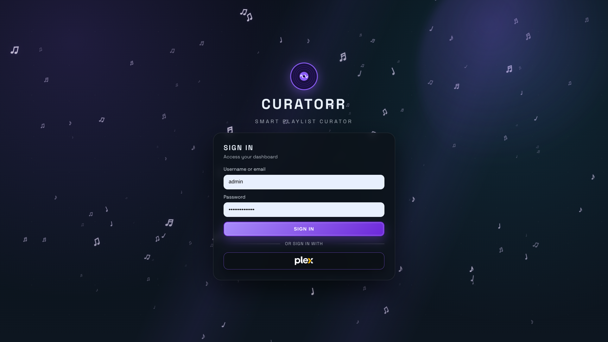

# Curatorr Wiki

Curatorr is a self-hosted Plex, Jellyfin, and Emby companion for playback tracking, smart playlists, artist discovery, and optional Lidarr automation.

Use this wiki as the operational source of truth for setup, playback sources, integrations, and day-to-day administration.

## Preview

### Dashboard

### Discover

### Playlists

### Login

## Start Here

1. [Quick Start](Quick-Start.md)
2. [Configuration](Configuration.md)
3. [Authentication and Roles](Authentication-and-Roles.md)
4. [Integrations](Integrations.md)
5. [Artist Suggestions and Lidarr Activity](Artist-Suggestions-and-Lidarr-Activity.md)
6. [Discover](Discover.md)
7. [Smart Playlists](Smart-Playlists.md)
8. [Troubleshooting](Troubleshooting.md)
9. [FAQ](FAQ.md)

## Page Guides

- [History](History.md)
- [Tracks](Tracks.md)
- [Blend](Blend.md)
- [User Profile](User-Profile.md)

## What Curatorr Solves

- Tracks plays from Plex, Jellyfin, or Emby, with optional Tautulli repair and backfill on Plex installs.
- Builds per-user smart playlists directly in the connected media server using real listening behavior.
- Scores artists in your own library to surface under-explored suggestions.
- Supports personal playlists, blended playlists, Daily Mix, and external discovery.
- Optionally connects to Lidarr to queue artists, pick starter albums, and progressively expand catalogs.
- Supports Last.fm history sync and station playlists, plus ListenBrainz playlist suggestions.

## Key Product Capabilities

- Multi-server support across Plex, Jellyfin, and Emby, with optional Tautulli live source or gap-fill support on Plex.
- Per-user track tiers: `Belter`, `Decent`, `Half Decent`, `Skip`, and `Curatorr`.
- Local admin account plus media-server sign-in support, including Plex Home profiles on Plex installs.
- Admin preview mode so the local admin can inspect the app as another Plex user.
- Per-user Last.fm and ListenBrainz integrations from User Profile.
- Theme customization for both global defaults and per-user appearance.

## Operational Endpoints

- `GET /healthz`
- `GET /api/version` (authenticated)
- `GET /api/logs` (authenticated)
