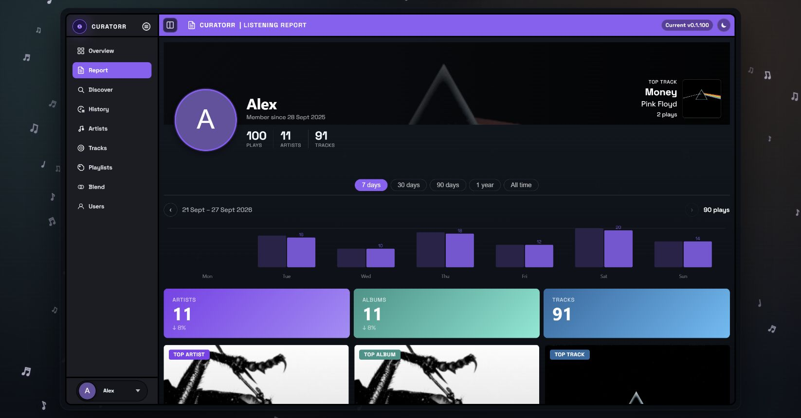

# Listening Report

Open **Report** in the sidebar for a detailed view of your listening habits.

## Choose a period

Select **7 days**, **30 days**, **90 days**, **1 year**, or **All time**. The report updates its totals, top music, and period-specific summaries. Where available, change indicators compare with the preceding period.

The weekly activity chart has separate previous/next week controls. The **Activity — Last 52 Weeks** heatmap always covers its stated annual window.

## What the report includes

- Plays, unique artists/albums/tracks, listening time, and active days.
- Top artists, albums, and tracks, plus how much listening is new to you.
- **Music Ratio**, comparing the numbers of tracks, albums, and artists.
- **Listening Fingerprint**: consistency, variety, loyalty, night-owl activity, and intensity.
- **Top Tags** and **Music by Decade**, where metadata is available.
- **Listening Clock**, busiest hour, tier breakdown, and skip rate.
- Activity heatmap, listening streak, and best day.

The fingerprint describes patterns in your recorded listening; its axes are not track tiers or artist recommendation scores. Sparse history or missing metadata can leave panels empty.

Completed [Music Assistant](Music-Assistant.md) plays join the same listener history. Check [History](History.md) if the report is missing expected plays, and check [Track Analysis](Track-Analysis.md) for audio features used in playlist building.
