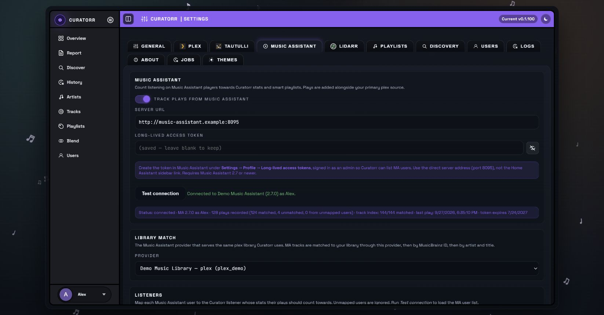
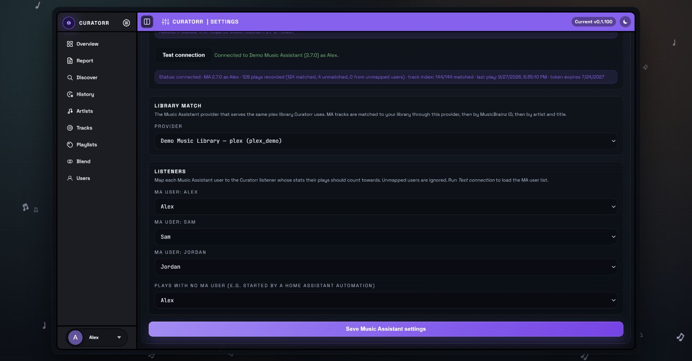

# Music Assistant

Available from Curatorr **v0.1.100**, Music Assistant (MA) adds listening from its players to your Curatorr history, artist scores, skips, and smart playlists. It runs alongside your primary Plex, Jellyfin, or Emby playback source.

Music Assistant is optional and disabled until you enable it. Your primary media server still supplies the library, sign-in, and playlist destination.

## Requirements

- Music Assistant **2.7 or newer**.
- The same Plex, Jellyfin, or Emby server added as a music provider in MA.
- A direct MA server address reachable from the Curatorr container.
- A long-lived MA access token created while signed in as an MA admin, so Curatorr can list users.
- An admin account in Curatorr to configure the integration.

## Connect Music Assistant

1. In MA, open **Settings → Profile → Long-lived access tokens** and create a token.
2. In Curatorr, open **Settings → Music Assistant**.
3. Enter the **Server URL**. For example, `http://music-assistant:8095` works if that hostname resolves from Curatorr's container; otherwise use your MA host's reachable address.
4. Paste the **Long-lived access token**, then select **Test connection**.
5. Under **Library match**, select the provider for the same media server and library Curatorr uses. Choose it explicitly if you have several providers; `Auto` uses the first provider of your primary server type.
6. Map MA users to Curatorr listeners as described below.
7. Turn on **Track plays from Music Assistant** and select **Save Music Assistant settings**.
8. Confirm the live status becomes `connected`.

For the Home Assistant app, use the MA host's direct address on port `8095`, rather than the Home Assistant sidebar/ingress URL. A reverse proxy must support WebSocket connections. No additional webhook registration or Curatorr environment variable is needed.

**Test connection** loads providers and users; it does not save the form or enable tracking. After saving a token, leaving its field blank keeps the saved token.

## Map listeners

For each MA user, select the Curatorr listener whose history should receive their plays. Review any suggested mappings before saving.

| Incoming play | What Curatorr does |
|---|---|
| MA user mapped to a listener | Records it for that listener |
| MA user set to `Ignore`, or not mapped | Drops the play |
| No MA user attached | Uses **Plays with no MA user**, if a listener is selected; otherwise ignores it |

The default listener only covers events without an MA user ID. It does not act as a fallback for an identified but unmapped user. This matters for playback started by Home Assistant automations.

When you return to this settings tab, saved mappings can initially show MA user IDs. **Test connection** reloads their display names and the current user list.

## Plays, pauses, and skips

Curatorr records a completed track, or a track that is stopped or skipped, using the listener's existing scoring settings. A stop that is not reported as complete waits about **60 seconds** before being finalised, because MA also reports pauses that way. Resuming during that interval cancels the pending stop; later reports for the same play update it. Replaying the track from the beginning can count as a separate play.

Matched tracks feed the normal track tiers and playlist rebuild path. Music Assistant streams from Plex do not normally appear as Plex/Tautulli playback sessions, so leave your primary playback source configured as before.

This integration listens to live events. It does not import historical MA listening or replay all events missed while Curatorr was disconnected.

## How tracks match your library

Curatorr tries these in order:

1. The MA provider's item mapping into Curatorr's library cache.
2. MusicBrainz recording ID.
3. Artist and track title, using duration to help select a match.

The same artist-aware matcher is used for playlist imports. If a track names an artist, an unrelated song with the same title is not a valid replacement.

An unmatched track, including a streaming-only track, can still contribute to listening history and artist scoring. It does **not** create a library track or make that recording available for playlist export. Even a streaming-provider play can match an existing local recording through its metadata.

Curatorr indexes MA's library and also resolves tracks as plays arrive. Large initial indexes can take time. Ensure **Master Track Cache Refresh** has populated Curatorr's primary library.

## Now Playing

The [Overview](Overview.md) card falls back to MA when there is no matching primary media-server session for the listener. A primary session, including a paused one, takes precedence.

MA queue attribution uses its reported user when available. Before a queue has reported a user, Curatorr can use the sole mapped listener, or the configured default listener. In a multi-user setup, the card may therefore wait for an attributed play report.

The card shows the current track's recorded non-skip play count, or **First play**. Plex-provider artwork can be shown; artwork unavailable through the supported path falls back to the music icon.

## Status and troubleshooting

The settings status shows the connection state, MA version/account, recorded plays, matched/unmatched counts, events from unmapped users, index progress when available, last play, and token expiry. The counters describe the current integration run and reset when it restarts; they are not lifetime listening totals. Events counted as coming from unmapped users were ignored.

| Symptom | Check |
|---|---|
| `not enabled` | Enable tracking and save; a successful test alone does not enable it |
| Connection fails or disconnects | Use the direct address, check container reachability and WebSocket proxy support |
| `auth_failed` | Replace an expired or revoked token, then save |
| `unsupported_version` | Upgrade MA to 2.7 or newer, then save the integration settings |
| Test cannot list users | Create the token from an MA admin account |
| No compatible provider listed | Add your primary media server to MA and test again |
| Connected, but no history | Check listener mappings, let a track finish, and allow the stop/pause delay |
| Many unmatched tracks | Check the provider, selected libraries, Curatorr's track cache, and track metadata |
| No Now Playing card | Check listener attribution and whether a primary session is taking precedence |

Temporary connection failures retry automatically with increasing delay. Authentication and version failures wait for a settings change. Inspect **Settings → Logs** for component `music-assistant`, especially `play.unmapped-user`, `play.recorded`, `connect.error`, and `index.error`.

MA long-lived tokens have a finite lifetime; the tested MA 2.10 setup issues them for one year. Use the expiry shown in Curatorr as the renewal reference. See the [Music Assistant authentication implementation](https://github.com/music-assistant/server/blob/dev/music_assistant/controllers/webserver/auth.py) for upstream token behavior.

## Playlists in Music Assistant

Curatorr continues to export playlists to its primary media server. Plex playlists, including Curatorr-generated ones, can then appear through MA's Plex provider. Curatorr does not separately push playlists into MA or control its players.

If a playlist is missing, verify it exists for the relevant Plex account first, then check the MA provider's account and sync. See [Smart Playlists](Smart-Playlists.md) and [Integrations](Integrations.md).
