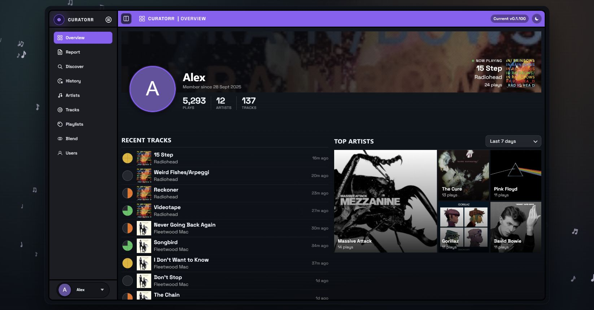

# Overview

Overview is your landing page for recent listening and favourites.

The profile header shows your play, artist, and track totals. The featured card normally shows your top track; during a recognised listening session it becomes **Now Playing**.

## Now Playing

Curatorr checks your primary Plex, Jellyfin, or Emby session, then falls back to a mapped [Music Assistant](Music-Assistant.md) queue. Paused sessions are included.

The count belongs to the track currently shown and excludes skips. **First play** means there are no recorded non-skip plays yet; the current play may not be saved until it finishes. When playback ends, the card returns to your top track and its count.

## Listening panels

- **Recent Tracks** shows your latest listening, with tier indicators and relative times.
- **Top Artists**, **Top Albums**, and **Top Tracks** have their own period selectors.
- **Top Playlists** shows playlists represented in your listening.

Click a supported artist, album, or track to open its detail popup. Flame icons identify popular album tracks based on Plex rating counts; they are separate from your personal tier.

Detail popups bring together metadata, albums or tracks, and available library/acquisition actions. Track details can show BPM, key, and other audio features when analysis is available, plus pin/unpin controls. Album popups distinguish music already in your library from monitored or requested albums.

Use [Report](Listening-Report.md) for period comparisons and listening patterns, [History](History.md) to audit individual plays, and [Tracks](Tracks.md) to inspect scoring and pin/exclude controls.
