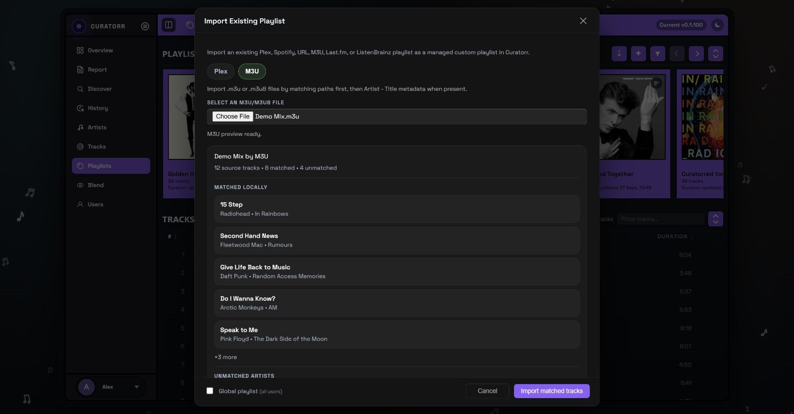

# Playlist Imports

Import existing selections from **Playlists → Import playlist**. Curatorr matches source tracks to your library and creates a managed playlist; importing metadata does not download the audio.

## Sources

| Source | Setup and behavior |
|---|---|
| Plex | Browse existing playlists and music collections on Plex installs |
| Spotify | Connect your account in User Profile; the connected-account tab browses owned playlists |
| TIDAL | Connect your account in User Profile; the TIDAL tab browses playlists owned by that account |
| URL | Preview supported Spotify, public TIDAL, or public YouTube playlist URLs; YouTube requires the container's `YOUTUBE_API_KEY` |
| M3U | Upload an `.m3u` or `.m3u8` file; matches paths first, then available artist/title metadata |
| Last.fm | Set your username in User Profile, then choose Recommended, Mix, Library, Neighbours, Loved, or a Top Tracks period |
| ListenBrainz | Set your username and optional token in User Profile, then choose Daily Jams, Weekly Jams, or Weekly Exploration |

Tabs and features depend on server type and configuration. Plex has the broadest import/integration support. See [Integrations](Integrations.md) for credentials and platform restrictions.

## Import and review

1. Select a source tab and choose or preview a playlist/file.
2. Review matched and missing counts.
3. Set the new playlist name. Administrators can choose a global playlist where that option is offered.
4. Complete the import and inspect the playlist card and track list.

The **Missing from source** section preserves unmatched entries for review. Select individual tracks or artist groups, then use **Queue for Lidarr review** or **Add to Lidarr queue** when available. Album metadata is retained for acquisition requests when supplied by the source.

## Matching accuracy

Curatorr prefers identifiers or file paths where the source provides them. Metadata matching considers credited artists and title, with duration helping select a match. A named artist must match one of the track's artists; a same-titled song by someone else is left unmatched. Bare M3U entries with no artist information can still use title matching.

From v0.1.99, refreshing an older import can remove wrong-artist matches and increase its missing count. This is expected. Check artist credits and library metadata before requesting missing music.

## Refresh and schedules

Use **Refresh import** from the card menu to re-read/rematch the source. The imported playlist editor offers **Disabled**, **Daily**, **Weekly**, or **Monthly** auto-refresh.

M3U/M3U8 imports support those schedules from v0.1.98. Curatorr stores the uploaded source in its database and rematches that stored content; it does not reread a changed file from your computer. Older imports without stored source content may need a one-time re-import. Newly available tracks return to their source positions once matched.

After adding music, refresh the master track cache before refreshing the import. Source refresh and playlist sync are separate from acquiring missing files through Lidarr.

## Convert an import to a smart playlist

Open the imported playlist's **Edit** dialog and choose **Convert to Smart** where offered. Curatorr opens a wizard draft with inferred audio/profile defaults and suggested content filters. Review the suggested chips or switch to all detected genres, moods, and tags, then adjust output rules before saving.

The finishing step can keep the original imported mirror or remove it. Keeping the mirror preserves a separately refreshable source playlist; the smart playlist instead follows the rules you save. Conversion is useful when you want the source's musical character to guide a playlist that can evolve beyond its original track list.

## Spotify URL previews

Owned playlists imported from the connected **Spotify** tab are the most reliable route for large playlists. The **URL** tab depends on Spotify's public page data and can expose only part of a shared/public playlist. If the preview is incomplete, copy the tracks into a playlist you own in Spotify and import that copy through the connected-account tab.

## TIDAL imports

The **TIDAL** tab lists playlists owned by the connected TIDAL account, including private ones. Public TIDAL playlist links (`https://tidal.com/playlist/...`) can be pasted into the **URL** tab by any user, whether or not they have connected TIDAL. A private playlist owned by another account can't be read; import it from the owner's Curatorr account instead.

Only tracks are imported. Videos in a TIDAL playlist are skipped and do not count as missing. TIDAL import requires `TIDAL_CLIENT_ID` and `TIDAL_CLIENT_SECRET` on the container; see [Integrations](Integrations.md#tidal).

See [Smart Playlists](Smart-Playlists.md) for artwork, filters, and general playlist management.
