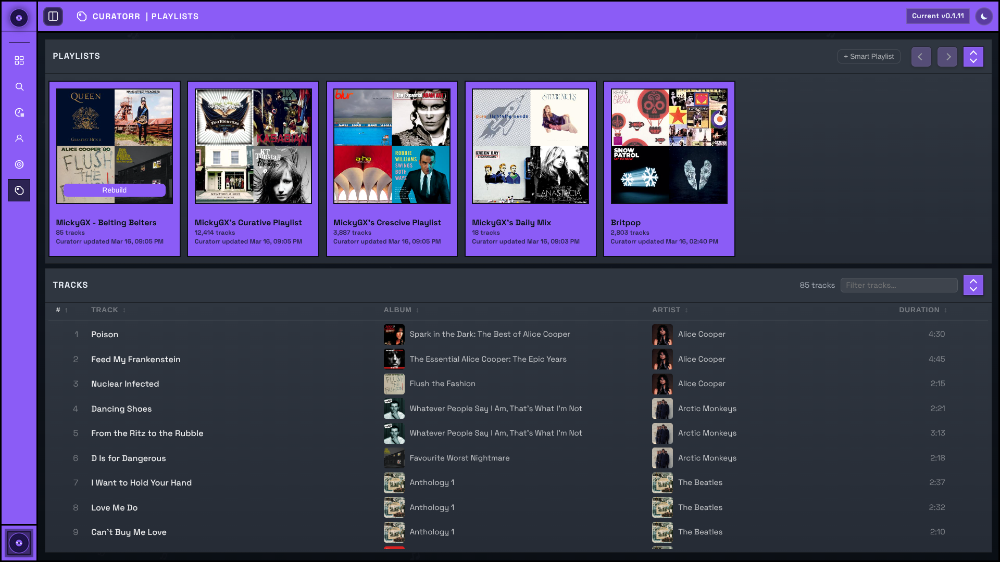

# Smart Playlists

Curatorr builds and maintains personalized playlists in the connected media server from real listening behavior.

## Track Tiers

Tracks are classified into:

- `Belter`
- `Decent`
- `Half Decent`
- `Skip`
- `Curatorr`

These are derived from actual playback duration and skip/completion behavior.

## Curatorr Rules

The core rules table controls:

- skip threshold
- completion threshold
- skip and belter weighting
- artist ranking thresholds
- song skip limit

`Half Decent` and `Decent` values are derived from the user-editable edge values and are shown as system-driven values in Settings.

## Artist Ranking

Artists carry a ranking score between `0` and `10`, starting at `5`.

Listening behavior moves that score over time:

- stronger positive engagement pushes artists upward
- repeated skips push artists downward

These artist scores influence:

- suggestion quality
- playlist inclusion
- automation progression

## Presets

Curatorr ships with:

- `Cautious`
- `Measured`
- `Aggressive`

The default preset for new users is set in Settings. Existing users keep their own selected preset.

## Crescive and Curative

Curatorr supports two starting-position strategies:

- `Crescive` starts tighter and grows
- `Curative` starts broader and is pruned

Both are configured in `Settings -> Smart Playlist Types`.

## Addition and Subtraction Rules

Playlist-type settings also include:

- addition rules by artist tier
- subtraction rules for skip-driven removal

These control when more tracks are surfaced or removed as engagement changes.

## Daily Mix and Personal Playlists

Curatorr also supports:

- Daily Mix
- personal rule-based playlists
- blended playlists across users

Smart playlists, personal playlists, and blended playlists sync on Plex, Jellyfin, and Emby. Daily Mix is currently Plex-only.

Last.fm station playlists and ListenBrainz playlist suggestions are also currently Plex-only exports.

These features use the same underlying play history, track tiers, and master track cache.

## Background Jobs

Relevant jobs include:

- Master Track Cache Refresh
- Smart Playlist Sync
- Daily Mix Sync
- optional Tautulli gap-fill
- Last.fm history sync

Use `Settings -> Jobs` to enable, disable, or manually run them.
