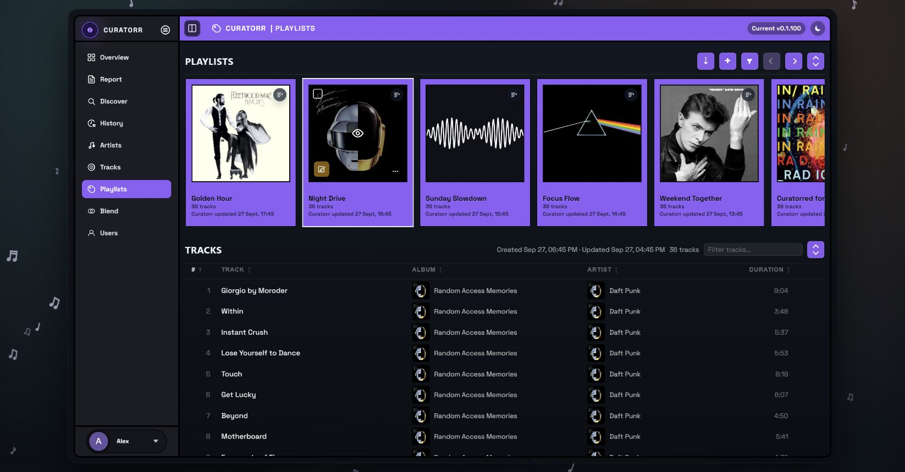
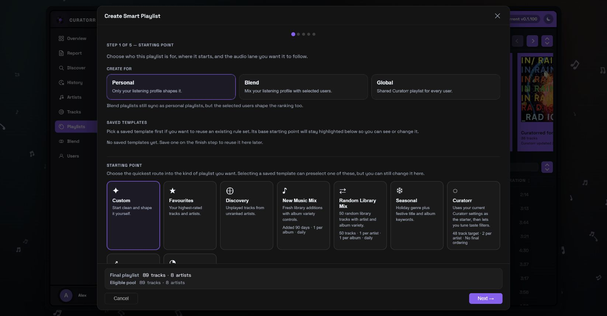

# Smart Playlists

Curatorr builds and maintains playlists in your connected media server from your listening and selected rules.

## Browse and manage playlists

Select a playlist card to view its tracks. The filter menu separates playlist categories such as personal, global, system, imported, and external. Cards show track counts, missing-source counts where relevant, update times, and refresh schedules.

Use a card's **View**, **Edit**, or options menu for the actions available to that playlist type. These can include rebuilding, refreshing an import, renaming, enabling/disabling, and artwork controls. System playlist name overrides change the exported title; clearing the override restores the generated name.

## Track tiers and artist scores

Track tiers are **Belter**, **Decent**, **Half Decent**, **Skip**, and **Curatorr**. Playback duration and skip/completion behavior drive classification. Artist scores and skip streaks influence which artists and tracks qualify for generated playlists.

Administrators configure defaults in **Settings → Playlists**. Users choose **Cautious**, **Measured**, or **Aggressive** curation in User Profile and maintain personal always/never-include artists. Cautious keeps a broader selection; Aggressive curates more tightly.

**Crescive** starts with a tighter selection that can grow through engagement. **Curative** starts more broadly and removes material through listening and skip rules. Configurable **Curatorr** rotation and **Daily Mix** provide other generated selections.

[Music Assistant](Music-Assistant.md) plays use the same scoring path for their mapped listener. Only tracks matched to the local library can be exported.

## Create a smart playlist

Select **Create smart playlist**. The wizard has four steps for regular users and an extra **Library scope & cleanup** step for administrators.

1. **Starting point:** choose Personal, Blend, or Global where permitted, then a saved template or built-in starting point. Options include Custom, Favourites, Discovery, New Music Mix, Random Library Mix, Seasonal, Curatorr, Crescive, and Curative. Optionally add an audio profile.
2. **Content filters:** shape the music using include/exclude/neutral chips and the available metadata filters. Audio profiles can suggest content chips; applying those suggestions is optional.
3. **Output rules:** set artist/album/total track caps, sort order, popularity filters, and duplicate handling.
4. **Library scope & cleanup** (admin only): refine library/path scope and advanced cleanup rules.
5. **Finish & create:** review the selection, name it, choose a rebuild schedule and supported artwork handling, then create it. For non-admin users, this is step four.

Content filters also include **Last played** (played within / not played within N days, or never played) and **Play count** (at least / at most N plays, counted from the listener's Curatorr play history). Combined with a play count sort and a total track cap, these can recreate "rediscover old favourites" style playlists.

The preview distinguishes the **Eligible pool** from the **Final playlist** after output limits and cleanup. If the result is unexpectedly small, check active filters, analysis coverage, caps, and deduplication rules.

Personal playlists with no current matches can be saved as Curatorr drafts for later editing when that option is offered; an empty draft is not a populated media-server playlist. Global saves validate the rule set before creating it.

## Audio profiles and ordering

Current audio profiles include **Workout**, **Focus**, **Late Night**, **Driving**, **Harmonic**, **Wake Up**, and **Downtempo**. They can set BPM, energy, danceability, and Camelot defaults, which you can then adjust.

Profiles show available audio-ready tracks. Required features must exist: tracks missing the relevant analysis do not qualify as zero-valued matches. See [Track Analysis](Track-Analysis.md).

**Camelot focus** accepts keys such as `8A` or `8A, 9A, 10A`. Spread options include exact, adjacent, relative, and full harmonic neighborhoods.

Output sorting includes popularity, tier weight, play count, new additions/releases, random, BPM, energy, danceability, Camelot, and DJ flow. Final ordering can add Plex sonic sequencing or loudness smoothing on supported Plex setups.

## Duplicate handling and variety

Output rules can deduplicate by MusicBrainz recording ID or artist/title, optionally requiring durations within five seconds. Additional guards keep likely live, demo, acoustic, remix, instrumental, or live-album variants separate. Studio and artist-folder preferences help choose among duplicates.

Artist and album caps improve variety. Album popularity uses the same top-three-by-Plex-rating definition as the flame icons; overall popularity selects a percentage of the candidate pool.

## Templates, schedules, and artwork

Save a rule set as a template for reuse. Selecting a template retains its base starting point so you can refine it; template management is available in the finishing step.

Rule-based playlists support **Daily**, **Weekly**, and **Manual** auto-rebuild schedules. This is separate from imported playlists' auto-refresh schedules.

For Plex, artwork handling supports **Auto-generated**, **Preserve existing artwork**, or **Custom artwork**. Custom images accept PNG, JPG, or WEBP up to 5 MB. Preserved/custom artwork is reapplied during sync.

## Imported playlists

Use **Import playlist** to browse Plex playlists/collections, connected Spotify playlists, supported URLs, M3U/M3U8 files, Last.fm sources, or ListenBrainz suggestions. Available tabs depend on your primary server and configured accounts.

Imports retain their source and missing tracks, support manual refresh, and can rematch as your library grows. See [Playlist Imports](Playlist-Imports.md) for the complete workflow and source restrictions.

## Blended playlists

Choose **Blend** in the wizard and add listeners, or use **Create blended playlist** from the [Blend](Blend.md) comparison page. Their listening shapes the ranking. A blend syncs as a personal playlist for its owner.

## Server support and jobs

Core smart, personal, and blended playlists support Plex, Jellyfin, and Emby. Plex has additional integrations including Daily Mix, Curatorr rotation, Last.fm station/ListenBrainz sync, sonic ordering, and loudness-aware sequencing.

Relevant jobs in **Settings → Jobs** include Master Track Cache Refresh, Smart Playlist Sync, Daily Mix Sync, Track Analysis Pipeline, and Plex Loudness Sync. New library tracks must reach the cache before rules or imports can match them.
