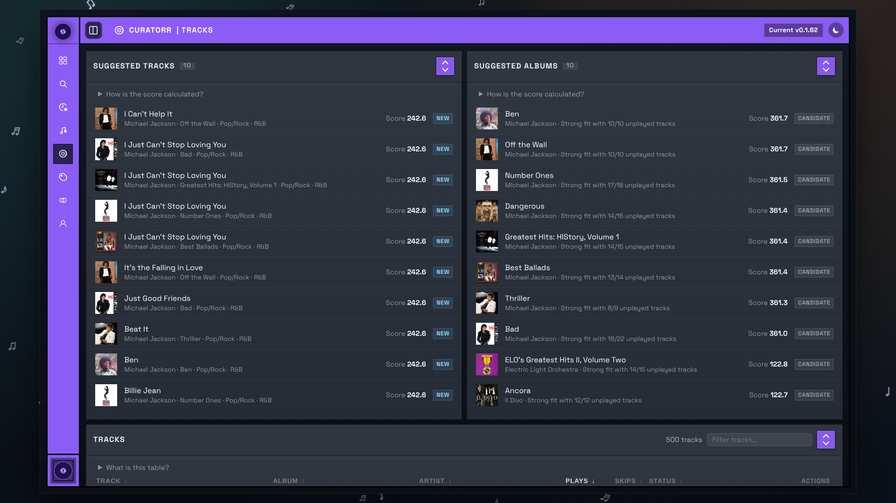

# Tracks

The Tracks page combines track-level scoring, rediscovery suggestions, and exclusion controls.

## Suggested Tracks

This panel highlights tracks that currently look strong for either:

- first-time discovery from your library
- rediscovery after they have gone quiet for a while

The score combines genre fit, listening behavior, and a small editorial bonus layer.

## Suggested Albums

This panel clusters strong track candidates into album-level suggestions.

Album ranking is driven by:

- the strength of the best matching tracks
- how much of the album is still unheard
- how well the artist fits your current taste profile

## Tracks table

The main table is the per-track summary Curatorr has built from your playback history.

It includes:

- total plays
- total skips
- current track tier/status
- exclude or re-include actions

The table is the quickest way to answer "why is Curatorr treating this track this way?" because it brings the score inputs, current tier, and exclusion state together in one place.

## Excluding tracks

Use `Exclude` when you never want a track to influence smart playlist scoring or suggestions.

Use `Re-include` to return an excluded track to normal scoring.

Excluded tracks remain visible for review, but Curatorr stops using them when building suggestions and playlist candidates.

## Related pages

- [Smart Playlists](Smart-Playlists.md)
- [History](History.md)
- [Artist Suggestions and Lidarr Activity](Artist-Suggestions-and-Lidarr-Activity.md)
