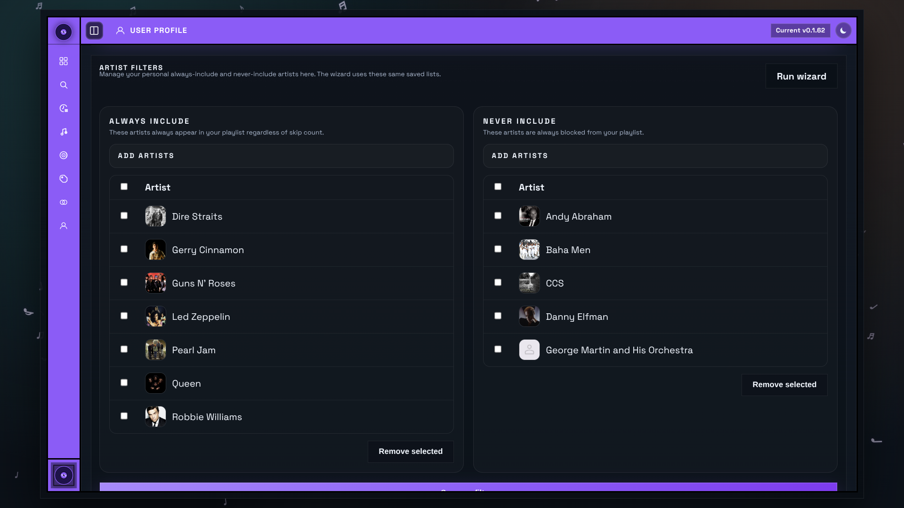

# User Profile

The User Profile page holds the settings that belong to one specific user rather than the whole Curatorr instance.

## Profile

Users can review:

- username
- account source
- email, when available
- current role

They can also upload a custom avatar image.

## Password

Local Curatorr accounts can change their password from this page.

Media-server-backed accounts continue to authenticate through Plex, Jellyfin, or Emby instead.

## Theme

Each user can save a personal appearance override, including:

- preset theme families
- custom accent color
- sidebar inversion
- square corners
- animated background
- carousel scrolling behavior
- scrollbar visibility

## Artist Filters

Users can maintain personal include/exclude artist filters that influence recommendations and playlist composition.

## Curation Style

Each user can pick their preferred smart-playlist preset such as `Cautious`, `Measured`, or `Aggressive`.

This changes how tightly or broadly Curatorr curates for that user.

## Spotify

If the Curatorr container is configured with `SPOTIFY_CLIENT_ID` and `SPOTIFY_CLIENT_SECRET`,
users can connect their own Spotify account from `User Profile`.

This enables:

- browsing their Spotify playlists from the Playlists page
- importing Spotify playlists into Curatorr
- refreshing previously imported Spotify playlists after the local library changes

If the Spotify section is missing entirely, the app-level credentials are not configured on the Curatorr container yet.

## Last.fm

Per-user Last.fm settings include:

- Last.fm username
- station playlist options
- top tracks period
- full-history backfill controls

## ListenBrainz

Per-user ListenBrainz settings include:

- username
- optional API token
- enabled playlist suggestion types

ListenBrainz currently contributes playlist suggestions, not listening history imports.

## Related pages

- [Authentication and Roles](Authentication-and-Roles.md)
- [Integrations](Integrations.md)
- [Smart Playlists](Smart-Playlists.md)
